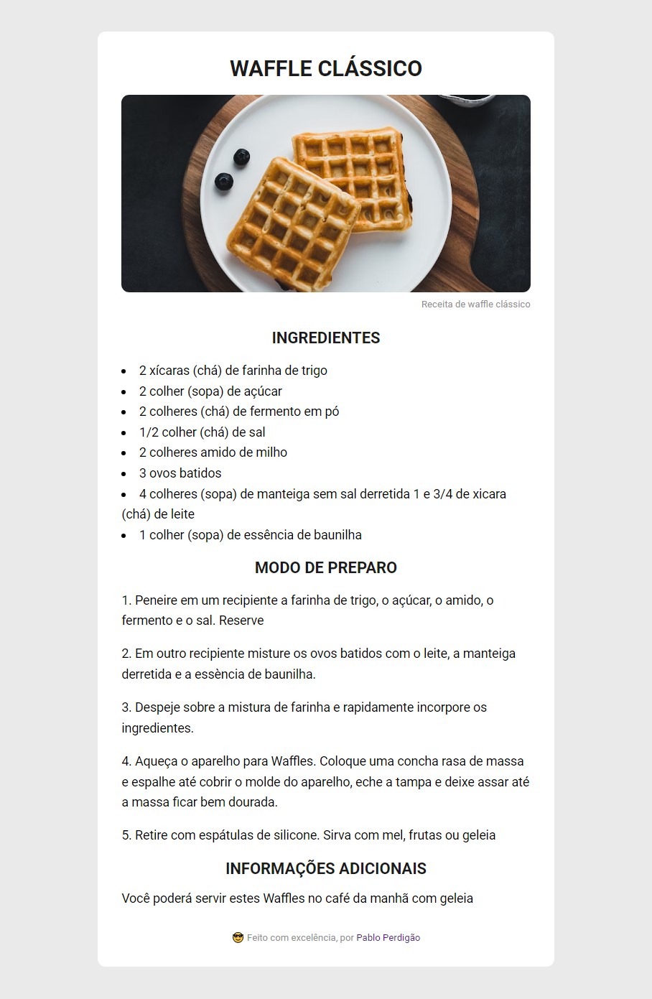

<h1 
 align="center">👨🏼‍💻Projeto-Discover I Página de Receita 🧇  🚀👨🏼‍🚀#desafiosdiscover
</h1>

 

⚠️<strong>ATENÇÃO</strong>⚠️
 
Este é um projeto conceitual e não representa uma empresa ou serviço real.   Ele foi criado com o propósito de ser adicionado ao meu portfólio, demonstrando minhas habilidades e capacidades em projetos de design e desenvolvimento.  
<a href="https://rocketforms.typeform.com/to/fPcSmBp9#referral_id=e8eb53b2-1777-4867-9b33-d468fc9d1422o">Desenvolva projetos como este clicando aqui!</a>

  <a href="#-tecnologias"> Tecnologias</a>&nbsp;&nbsp;&nbsp;|&nbsp;&nbsp;&nbsp;
  <a href="#-projeto">Projeto</a>&nbsp;&nbsp;&nbsp;|&nbsp;&nbsp;&nbsp;
  <a href="#-layout">Layout</a>

 

  

## 🚀 Tecnologias

Esse projeto foi desenvolvido com as seguintes tecnologias:

- HTML e CSS
- Git e Github
- Notion

## 💻 Projeto

Esse Projeto é uma página web de uma receita com título, imagem, lista de ingredientes e modo de preparo.
Este projeto possui um link principal:

- [Link de acesso ao meu perfil no GitHub](https://github.com/PabloPerdigao/)

## 🔖 Layout

Você pode visualizar o layout do projeto através [DESSE LINK](https://efficient-sloth-d85.notion.site/Desafio-Piloto-P-gina-de-Receita-15acc6a34f744484a2e64a1f115bfbae).   <strong>OBS:
</strong> Recomendo ter uma conta no [Notion](https://www.notion.so/).

---

😉 Feito com 💜 by Pablo Perdigão, aluno Explorer da Rocketseat!  
📲 [Participe da comunidade Rocketseat!](https://discord.gg/rocketseat)
